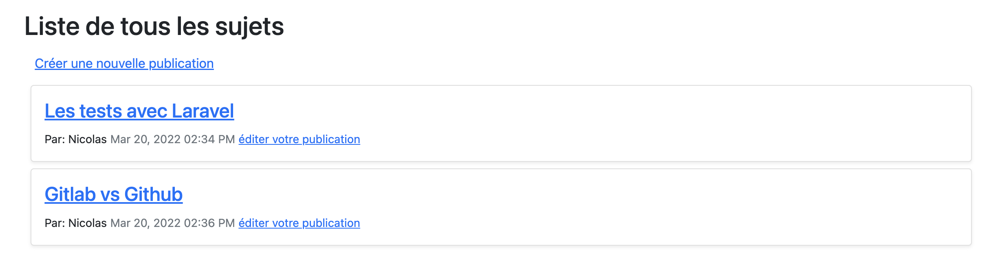
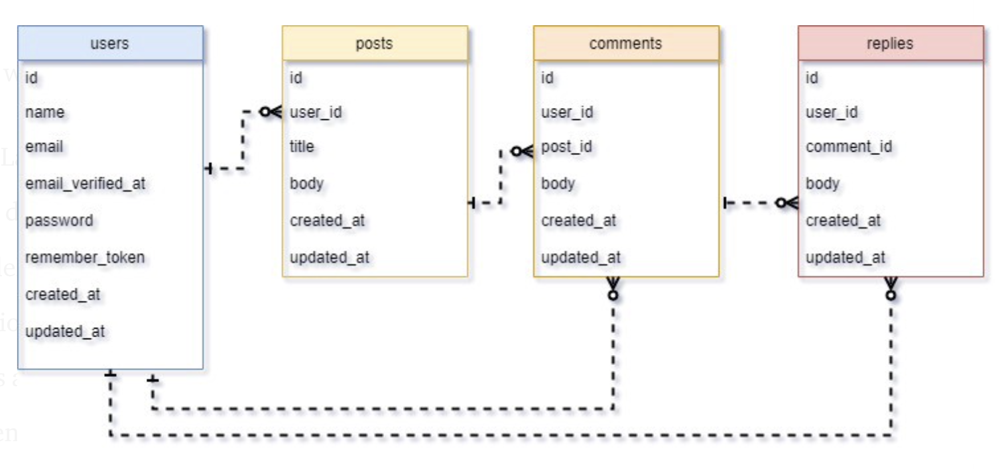

# Créer un blog minimaliste avec Laravel

L'objectif de ce tutoriel est de prendre en main Laravel en réalisant un système minimaliste de blog.<br>

L'aspect de l'application sera le suivant :



Pour ce tutoriel, nous allons utiliser le schéma de bdd suivant :


## 1 - Un nouveau projet Laravel

Avant de démarrer notre développement, nous avons besoin des outils suivant :
* _Windows Subsystem for Linux 2_ associé à une instance Linux pour les utilisateurs de Windows. L'installation est documentée [ici](https://blog.devgenius.io/kickstart-your-laravel-web-app-using-laravel-sail-30276265e588) et [là](https://web-id.fr/blog/setup-windows-wsl2-x-ubuntu-x-laravel-sail-docker)
* [Docker Desktop](https://docs.docker.com/desktop/).
* [Visual Studio Code](https://code.visualstudio.com/Download)
* [Un compte Gitlab](https://gitlab.com/users/sign_in)

Ensuite, on [créer un nouveau projet Laravel](https://laravel.com/docs/9.x)

```bash
curl -s "https://laravel.build/minimalist-blog-laravel" | bash
```

On ouvre le dossier _minimalist-blog-laravel_ avec Visual Studio <br>
Dans Visual Studio, on ouvre un terminal et lance :

```bash
./vendor/bin/sail up -d
```
<em>-d pour detach mode</em>

Une fois les conteneurs Docker de l'application démarrés, vous devez exécuter les migrations de base de données de votre application :

```bash
./vendor/bin/sail artisan migrate
```

Sur mon installation (macOS), j'obtiens le message d'erreur ```SQLSTATE[HY000] [1045] Access denied for user 'sail'@'172.18.0.7'```et dois modifier la ligne ```APP_URL=localhost``` en ```APP_URL=http://127.0.0.1```

Prenez le temps d'observer les relations entre le fichier _docker-compose.yml_ à la racine de notre projet et _Containers/Apps_ de _Docker Desktop_ <br>
En effet, derrier sail se cache docker-compose. <br>

Enfin, jetons un coup d'oeil à http://localhost !<br>

## 2 - Models, migrations et controllers

Nous allons maintenant notre projet Laravel pour correspondre au schéma de bdd présenté en introduction. <br>
Pour cela, nous allons manipuler trois types de fichiers :
* Les [models](https://laravel.com/docs/9.x/eloquent) (app/Models)
* Les fichiers de [migrations](https://laravel.com/docs/9.x/migrations) (database/migrations)
* Et les [controllers](https://laravel.com/docs/9.x/controllers) (app/Http/Controllers)

On créer les models avec les fichiers de migration et controllers ([Doc](https://laravel.com/docs/9.x/eloquent#generating-model-classes)) <br>

Nous allons utiliser [artisan](https://laravel.com/docs/9.x/artisan), l'interface en ligne de commande de Laravel pour générer ces fichiers ! <br>
Attention, nous utilisons artisan à travers [sail](https://laravel.com/docs/9.x/sail)

```bash
sail php artisan make:model Post -mc     # migration et controller
```
Enfin, adaptez cette commande pour _Comment_ et _Reply_ !

### Contenu des migrations

Ici, nous allons ajouter les champs à nos tables. <br>

Modifier la fonction up() de database/migrations/create_posts_table.php tel que :
```php
public function up()
{
    Schema::create('posts', function (Blueprint $table) {
        $table->bigIncrements('id');
        $table->unsignedInteger('user_id');
        $table->string('title');
        $table->text('body');
        $table->timestamps();
    });
}
```

Avec l'exemple de create_posts_table.php, modifier les fonctions up() de database/migrations/create_comments_table.php et database/migrations/create_replies_table.php.<br>


### Contenu des models et création des relations

Notre schéma de bdd contient des tables ainsi que des relations !

Commençons par ajouter une relation _one-to_many_ au model User (ce modèle était déjà présent à la création du projet Laravel) en ajoutant la fonction suivante à la classe User :
```php
/** User model **/
/** One to Many relation with Post **/
public function posts() 
{
    return $this->hasMany(Post::class, 'user_id');
}
```

Ensuite, on ajoute des attributs et les relations au model Post
```php
<?php

namespace App\Models;

use Illuminate\Database\Eloquent\Model;

class Post extends Model
{
    // table name to be used
    protected $table = 'posts';

    // columns to be allowed in mass-assingment 
    protected $fillable = ['user_id', 'title', 'body'];

    /* Relations */

    // One to many inverse relationship with User model
    public function owner() {
    	return $this->belongsTo(User::class, 'user_id');
    }

    // One to Many relationship with Comment model
    public function comments()
    {
    	return $this->hasMany(Comment::class, 'post_id');
    }

    /**
     * get show post route
     *
     * @return string
     */
    public function path()
    {
        return "/posts/{$this->id}";
    }
}
```

Ainsi qu'au model Comment
```php
<?php

namespace App\Models;

use Illuminate\Database\Eloquent\Model;

class Comment extends Model
{
    # table name to be used by model
    protected $table = 'comments';

    # columns to be allowed in mass-assingment
    protected $fillable = ['user_id', 'post_id', 'body'];

    /** Relations */

    # One-to-Many inverse relation with User model.
    public function owner()
    {
        return $this->belongsTo(User::class, 'user_id');
    }

    # One-to-Many inverse relation with Post model.
    public function post()
    {
    	return $this->belongsTo(Post::class, 'post_id');
    }

    # One-to-Many relation with Reply model.
    public function replies()
    {
    	return $this->hasMany(Reply::class, 'comment_id');
    }
}
```

Enfin, à vous de compléter la class Reply
```php
<?php

namespace App\Models;

use Illuminate\Database\Eloquent\Model;

class Reply extends Model
{
    // table name to be used by model.
    protected $table = 'replies';

    // columns names to be used in mass-assignment
    protected $fillable = ['user_id', 'comment_id', 'body'];

    /* Relations */

    // One-to-Many inverse relationship with User model.
    /*
    	Code here
    */

    // One-to-Many inverse relationship with Comment model.
    /*
    	Code here
    */  
}
```

Grâce à (Eloquent)[https://laravel.com/docs/9.x/eloquent] nous "avons codé" notre bdd sans écrire de SQL !

## L'authentification

Nous allons utiliser (Laravel Breeze)[https://laravel.com/docs/9.x/starter-kits#laravel-breeze] pour implémenter l'authentification. <br>

❗ Suivez la documentation officielle sans oublier que nous intéragissons avec nos services via Sail

Breeze utilise le framework CSS Tailwind. Dans la suite de ce TP, nous créerons des vues avec Bootstrap, un autre framework CSS.

## Les routes

Nous allons rendre notre application accessible via la route _/home_, pour cela nous allons modifier le fichier routes/web.php <br>
La gestion des routes avec Laravel est expliqué dans la documentation : https://laravel.com/docs/9.x/routing <br>
Le middleware _auth_ nous permet de limiter l'accès à l'application aux utilisateurs authentifiés. <br>
Remplacez le contenu de web.php par le code suivant :

```php
<?php

use Illuminate\Support\Facades\Route;

use App\Http\Controllers\CommentController;
use App\Http\Controllers\HomeController;
use App\Http\Controllers\PostController;
use App\Http\Controllers\ReplyController;

/*
|--------------------------------------------------------------------------
| Web Routes
|--------------------------------------------------------------------------
|
| Here is where you can register web routes for your application. These
| routes are loaded by the RouteServiceProvider within a group which
| contains the "web" middleware group. Now create something great!
|
*/

Route::get('/', function () {
    return view('welcome');
});

Route::get('/dashboard', function () {
    return view('dashboard');
})->middleware(['auth'])->name('dashboard');

require __DIR__.'/auth.php';

// group the following routes by auth middleware - you have to be signed-in to proceeed
Route::group(['middleware' => 'auth'], function() {
	// Dashboard
	Route::get('/home', [HomeController::class, 'index'])->name('home');

	// Posts resourcefull controllers routes
	Route::resource('posts', PostController::class);

	// Comments routes
	Route::group(['prefix' => '/comments', 'as' => 'comments.'], function() {
        // store comment route
		Route::post('/{post}', [CommentController::class, 'store'])->name('store');
	});

	// Replies routes
	Route::group(['prefix' => '/replies', 'as' => 'replies.'], function() {
        // store reply route
		Route::post('/{comment}', [ReplyController::class, 'store'])->name('store');
	});

	// Update v10
    	Route::get('/profile', [ProfileController::class, 'edit'])->name('profile.edit');
    	Route::patch('/profile', [ProfileController::class, 'update'])->name('profile.update');
    	Route::delete('/profile', [ProfileController::class, 'destroy'])->name('profile.destroy');
});
```

## Les vues

1 - Nous allons créer l'arborescence de dossier _resources/views/posts/partials_ pour héberger nos blocks de code. <br>

2 - Créer le fichier home.blade.php dans _resources/views/_
```php
@extends('layouts.main')

@section('content')

<div class="clearfix">
    <h2 class="float-left">Liste de tous les sujets</h2>

    {{-- link to create new post --}}
    <a href="{{ route('posts.create') }}" class="btn btn-link float-right">Créer une nouvelle publication</a>
</div>

{{-- List all posts --}}
@forelse ($posts as $post)
    <div class="card m-2 shadow-sm">
        <div class="card-body">

            {{-- post title --}}
            <h4 class="card-title">
                <a href="{{ route('posts.show', $post->id) }}">{{ $post->title }}</a>
            </h4>

            <p class="card-text">
                
                {{-- post owner --}}
                <small class="float-left">Par: {{ $post->owner->name }}</small>

                {{-- creation time --}}
                <small class="float-right text-muted">{{ $post->created_at->format('M d, Y h:i A') }}</small>
                
                {{-- check if the signed-in user is the post owner, then show edit post link --}}
                @if (auth()->id() == $post->owner->id )
                    {{-- edit post link --}}
                    <small class="float-right mr-2 ml-2">
                        <a href="{{ route('posts.edit', $post->id) }}" class="float-right">éditer votre publication</a>
                    </small>
                @endif
            </p>
        </div>
    </div>
@empty
    <p>Aucune publication créée pour l'instant !</p>
@endforelse

@endsection
```

Nous créons le layouts _resources/view/layouts/main.blade.php_
Nous avons ainsi deux layouts, _app.blade.php_ qui utilise Tailwind et _main.blade.php_ pour Bootstrap

```php
<!DOCTYPE html>
<html lang="{{ str_replace('_', '-', app()->getLocale()) }}">
    <head>
        <meta charset="utf-8">
        <meta name="viewport" content="width=device-width, initial-scale=1">
        <meta name="csrf-token" content="{{ csrf_token() }}">

        <title>{{ config('app.name', 'Laravel') }}</title>

        <!-- Fonts -->
        <link rel="stylesheet" href="https://fonts.googleapis.com/css2?family=Nunito:wght@400;600;700&display=swap">

        <!-- Styles -->
        <link href="https://cdn.jsdelivr.net/npm/bootstrap@5.1.3/dist/css/bootstrap.min.css" rel="stylesheet" integrity="sha384-1BmE4kWBq78iYhFldvKuhfTAU6auU8tT94WrHftjDbrCEXSU1oBoqyl2QvZ6jIW3" crossorigin="anonymous">

        <!-- Scripts -->
        <script src="{{ asset('js/app.js') }}" defer></script>
    </head>
    <body>

        <main class="container col-md-8 py-4">
            @yield('content')
        </main>

    </body>
</html>
```

Dans le dossier _posts_, nous créons les fichiers :
* create.blade.php
* edit.blade.php
* show.blade.php

create.blade.php
```php
@extends('layouts.main')

@section('content')

	{{-- Start card --}}
    <div class="card shadow">
        <div class="card-body">
            <h4 class="card-title">Créer une nouvelle publication</h4>
            <div class="card-text">
                @include('posts.partials.create_post')
            </div>
        </div>
    </div>
  {{-- End --}}
    
@endsection
```

show.blade.php
```php
@extends('layouts.main')

@section('content')

	{{-- show post --}}
	@include('posts.partials.post')

@endsection
```

edit.blade.php
```php
@extends('layouts.main')

@section('content')
    {{-- show edit post form --}}
    @include('posts.partials.edit_post')
@endsection
```
## Fichiers du dossier _partials_

post.blade.php
```php
<div class="card shadow">
  <div class="card-body">

  	{{-- Post title  --}}
    <h4 class="card-title">
    	{{ $post->title }}
    </h4>

    {{-- Owner name with created_at --}}
    <small class="text-muted">
    	Publié par : <b>{{ $post->owner->name }}</b> le {{ $post->created_at->format('M d, Y H:i:s') }}
    </small>

    {{-- Post body --}}
    <p class="card-text">
    	{{ $post->body }}
    </p>

    {{-- include all comments related to this post --}}
    <hr>
    @include('posts.partials.comments')
  </div>
</div>
```

add_comment.blade.php
```php
<form action="{{ route('comments.store', $post->id) }}" method="POST" class="mt-2 mb-4">
	@csrf

	<div class="input-group">
	  <input 
	  	name="new_comment" 
	  	type="text" 
	  	class="form-control" 
	  	placeholder="écrire votre commentaire.."
	  	required>

	  <div class="input-group-append">
	    <button class="btn btn-primary" type="submit">Ajouter un commentaire</button> 
	  </div>

	</div>

</form>
```

add_reply.blade.php
```php
<form action="{{ route('replies.store', $comment->id) }}" method="POST" class="mb-2">
	@csrf

	<div class="input-group">
	  <input 
	  	name="new_reply" 
	  	type="text" 
	  	class="form-control" 
	  	placeholder="écrire votre réponse.."
	  	required>

	  <div class="input-group-append">
	    <button class="btn btn-primary" type="submit">répondre</button> 
	  </div>

	</div>

</form>
```

comments.blade.php
```php
<h4 class="card-title">Commentaires</h4>

{{-- add comment form --}}
@include('posts.partials.add_comment')
    
{{-- list all comments --}}
@forelse($post->comments as $comment)
	<div class="card-text">
		<b>{{ $comment->owner->name }}</b> dit
		<small class="text-muted">
		    {{ $comment->created_at->diffForHumans() }}
		</small>
		<p>{{ $comment->body }}</p>

		{{-- include add reply form --}}
		@include('posts.partials.add_reply')

		{{-- list all replies --}}
		@include('posts.partials.replies')
	</div>
	{!! $loop->last ? '' : '<hr>' !!}
@empty
	<p class="card-text">Il n'y a pas encore de commentaires !</p>
@endforelse
```

create_post.blade.php
```php
<form action="{{ route('posts.store') }}" method="post">
    @csrf

    {{-- Post title --}}
    <div class="form-group">
      <label for="title">Titre de la publication</label>
      <input type="text"
                name="title"
                id="title"
                class="form-control"
                placeholder="écrire le titre de la publication ici ..."
                required />

        @if ($errors->has('title'))
            <small class="text-danger">{{ $errors->first('title') }}</small>
        @endif
    </div>
    {{-- End --}}

    {{-- Post body --}}
    <div class="form-group">
      <label for="body">Contenu de la publication</label>
      <textarea class="form-control"
                name="body"
                id="body"
                rows="3"
                placeholder="écrire le contenu de la publication ici ..."
                required
                style="resize: none;"></textarea>

        @if ($errors->has('body'))
            <small class="text-danger">{{ $errors->first('body') }}</small>
        @endif
    </div>

    <div class="form-group">
        <button type="submit" class="btn btn-primary">Sauvegarder la publication</button>
        <a href="{{ route('home') }}" class="btn btn-default">Retour</a>
    </div>

</form>
```

edit_post.blade.php
```php
<form action="{{ route('posts.update', $post->id) }}" method="post">
    @csrf
    @method('PATCH')

    {{-- Post title --}}
    <div class="form-group">
      <label for="title">Titre de la publication</label>
      <input type="text"
                name="title"
                id="title"
                class="form-control"
                value="{{ $post->title }}"
                placeholder="écire le titre de la publication ici ..."
                required />

        @if ($errors->has('title'))
            <small class="text-danger">{{ $errors->first('title') }}</small>
        @endif
    </div>
    {{-- End --}}

    {{-- Post body --}}
    <div class="form-group">
      <label for="body">Contenu de la publication</label>
      <textarea class="form-control"
                name="body"
                id="body"
                rows="3"
                placeholder="écrire le contenu de la publication ici ..."
                required
                style="resize: none;">{{ $post->body }}</textarea>

        @if ($errors->has('body'))
            <small class="text-danger">{{ $errors->first('body') }}</small>
        @endif
    </div>

    <div class="form-group">
        <button type="submit" class="btn btn-primary">Mettre à jour la publication</button>
        <a href="{{ route('home') }}" class="btn btn-default">Retour</a>
    </div>

</form>
```

replies.blade.php
```php
{{-- list all replies for a comment --}}
@foreach ($comment->replies as $reply)
    
  <div class="ml-4">
		<b>{{ $reply->owner->name }}</b> a répondu
		<small class="text-muted float">{{ $reply->created_at->diffForHumans() }}</small>
		<p>{{ $reply->body }}</p>
  </div>

@endforeach
```

## Controllers

Dans _app/Http/Controllers_ nous commençons par PostController.php

```php
<?php

namespace App\Http\Controllers;

use App\Models\Post;
use Illuminate\Http\Request;

class PostController extends Controller
{

    /**
     * Show the form for creating a new resource.
     *
     * @return \Illuminate\Http\Response
     */
    public function create()
    {
        // view create form
        return view('posts.create');
    }

    /**
     * Store a newly created resource in storage.
     *
     * @param  \Illuminate\Http\Request  $request
     * @return \Illuminate\Http\Response
     */
    public function store(Request $request)
    {
        // validate incoming request data with validation rules
        $this->validate(request(), [
            'title' => 'required|min:1|max:255',
            'body'  => 'required|min:1|max:300'
        ]);

        // store data with create() method
        $post = Post::create([
            'user_id'   => auth()->id(),
            'title'     => request()->title,
            'body'      => request()->body
        ]);

        // redirect to show post URL
        return redirect($post->path());
    }

    /**
     * Display the specified resource.
     *
     * @param  \App\Post  $post
     * @return \Illuminate\Http\Response
     */
    public function show(Post $post)
    {
        // we are using route model binding 
        // view show page with post data
        return view('posts.show')->with('post', $post);
    }

    /**
     * Show the form for editing the specified resource.
     *
     * @param  \App\Post  $post
     * @return \Illuminate\Http\Response
     */
    public function edit(Post $post)
    {
        // we are using route model binding 
        // view edit page with post data
        return view('posts.edit')->with('post', $post);
    }

    /**
     * Update the specified resource in storage.
     *
     * @param  \Illuminate\Http\Request  $request
     * @param  \App\Post  $post
     * @return \Illuminate\Http\Response
     */
    public function update(Request $request, Post $post)
    {
        // validate incoming request data with validation rules
        $this->validate(request(), [
            'title' => 'required|min:1|max:255',
            'body'  => 'required|min:1|max:300'
        ]);

        // update post with new data using update() method
        $post->update([
            'title'     => request()->title,
            'body'      => request()->body
        ]);

        // return to show post URL
        return redirect($post->path());
    }

    /**
     * Remove the specified resource from storage.
     *
     * @param  \App\Post  $post
     * @return \Illuminate\Http\Response
     */
    public function destroy(Post $post)
    {
        //
    }
}
```

Ensuite, CommentController.php
```php
<?php

namespace App\Http\Controllers;

use App\Models\Post;
use App\Models\Comment;
use Illuminate\Http\Request;

class CommentController extends Controller
{
    /**
     * Store a newly created resource in storage.
     *
     * @param  \Illuminate\Http\Request  $request
     * @return \Illuminate\Http\Response
     */
    public function store(Post $post)
    {
        // validate incoming request data
        $this->validate(request(), [
            'new_comment' => 'required|min:1|max:255'
        ]);

        // store comment
        $post->comments()->create([
            'user_id'   => auth()->id(),
            'body'      => request()->new_comment
        ]);

        // redirect to the previous URL
        return redirect()->back();
    }
}
```

ReplyController
```php
<?php

namespace App\Http\Controllers;

use App\Models\Comment;
use App\Models\Reply;
use Illuminate\Http\Request;

class ReplyController extends Controller
{
    /**
     * Store a newly created resource in storage.
     *
     * @param  \Illuminate\Http\Request  $request
     * @return \Illuminate\Http\Response
     */
    public function store(Comment $comment)
    {
        // validate incoming data with validation rules
        $this->validate(request(), [
            'new_reply' => 'required|min:1|max:255'
        ]);

        /** 
        *    store the new reply through relationship, 
        *    through this way you don't have to 
        *    provide `comment_id` field inside create() method
        */
        $comment->replies()->create([
            'user_id' => auth()->id(),
            'body' => request()->new_reply
        ]);

        // redirect to the previous URL
        return redirect()->back();
    }
}
```

Enfin, HomeController.php

```php
<?php

namespace App\Http\Controllers;

use Illuminate\Http\Request;

use App\Models\Post;

class HomeController extends Controller
{
    /**
     * Create a new controller instance.
     *
     * @return void
     */
    public function __construct()
    {
        $this->middleware('auth');
    }

    /**
     * Show the application dashboard.
     *
     * @return \Illuminate\Contracts\Support\Renderable
     */
    public function index()
    {
        // get all posts to list them for the user
        $posts = Post::all();

        // view home page with all posts from database.
        return view('home')->with('posts', $posts);
    }
}
```

S'il n'a pas été généré, le contenu de Controller.php est le suivant :

```php
<?php

namespace App\Http\Controllers;

use Illuminate\Foundation\Auth\Access\AuthorizesRequests;
use Illuminate\Foundation\Validation\ValidatesRequests;
use Illuminate\Routing\Controller as BaseController;

class Controller extends BaseController
{
    use AuthorizesRequests, ValidatesRequests;
}
```