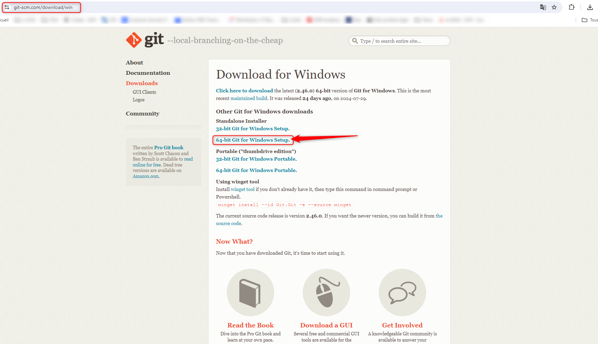
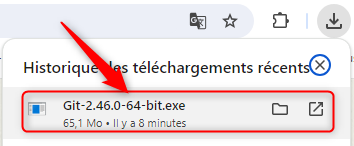
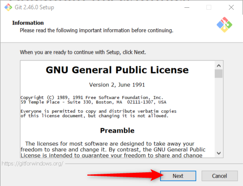
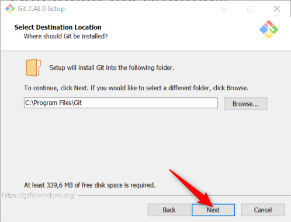
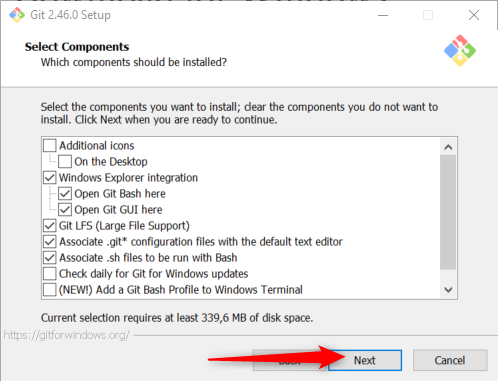
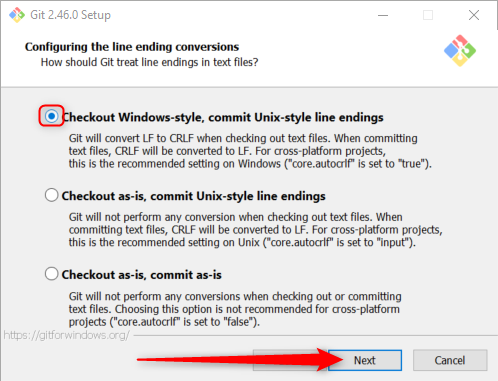
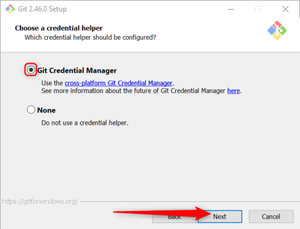
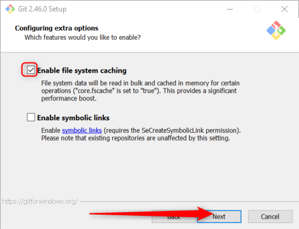
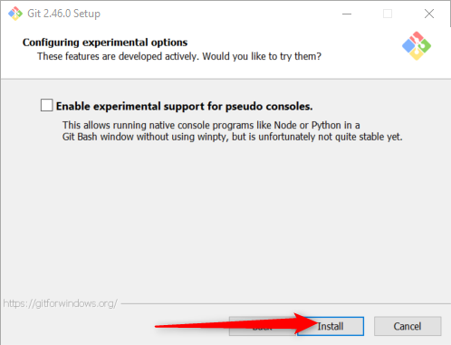
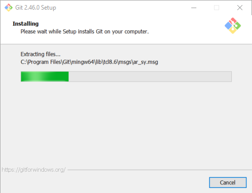

# 1 - Installation et configuration de GIT

### Sous Debian

```sh
sudo apt-get install git
git --version
```

[Pour les distributions autres que Debian](http://git-scm.com/download/linux)

### Sous MacOS ou Windows

* [git-scm.com](https://git-scm.com)

<br>

Pour la grande majoritée d'entre nous : la version <em>Standalone</em> 64-bit

<br>

Lancer l'exécutable

<br>

Les conditions générales d'utilisation

<br>

L'emplacement de l'installation peut être laissé par défaut

<br>

Les composants <em>Git Bash</em> et <em>Git GUI</em> sont à installer <br>
Libre à vous de tester <em>Git Bash Profile</em> dans le terminal Windows

<br>

Vous pouvez laisser le programme d'installation créer un raccourci

<br>

Visual Studio Code sera utilisé lors des TP

<br>

Nous utiliserons <em>main</em> comme nom de branche par défaut

<br>

Git peut être, et sera appelé depuis diffénts programmes

<br>

Le protocole SSH sera utilisé pour communiquer avec les dépôts distants

<br>

Nous utiliserons les certificats par défaut

<br>

Les retours à la ligne sont différents sur Windows et Linux, nous laisserons Git gérer cette spécificité

<br>

Git Bash utilise un emulateur de terminal

<br>

Lorsque nous exécuterons la commande <code>git pull </code>, Git effectueras un <em>fast-forward</em> our un <em>merge commit</em> en fonction des différences entre les dépôts.

<br>

Pour s'authentifier et interragir avec des dépôts distants, nous avons besoin de <em>Git Credential Manger</em>

<br>

Le cache permet d'améliorer les performances du système.<br>
Nous n'avons pas besoin de manipuler des liens symboliques dans les TP proposés<br>

<br>

Cette fonctionnalité n'est pas stable pour Git 2.46.0

<br>

L'installation se lance

<br>

Ouvrir Git Bash

<br>

Git Bash nous permet d'interragir avec notre système via des commandes Linux.<br>
<code>pwd</code> permet d'afficher le chemin d'accès vers le répertoire où se situe l'utilisateur qui a entré la commande

<br>


### Configuration minimale
```sh
git config --global user.name "Prenom nom"
git config --global user.email email@domaine.extension
```

Ici, nous utilison l'argument --global qui correspond au niveau utilisateur.<br/>
Les différents niveaux de configuration de Git, dont les éléments sont stockés dans différents fichiers sont :
|niveau|argument|fichier|
|---|---|---|
|système|--system|/etc/gitconfig|
|utilisateur|--global|~/.gitconfig|
|dépôt|--local|.git/config|

### Aide

```sh
git --help
git config --help # Pour visualiser le manuel de la commande config
```

### Configuration des paramètres

#### L'éditeur de texte par défaut

Exemple où l'on définit _vi_ comme éditeur par défaut
```sh
git config --global core.editor vi
```

#### Template de message de commit

Un modèle de contenu de commit peut-être instauré ajoutant le fichier [~/versions-du-code-source/1_Configuration/template-commit.txt](https://github.com/nicolas-sanch/versions-du-code-source/blob/main/1_Configuration/template-commit.txt) à la configuration

```sh
git config --global commit.template ~/versions-du-code-source/1_Configuration/template-commit.txt
```

#### Ignorer des fichiers
⚠️ Avant même de créer notre premier projet Git, il est important d'avoir à l'esprit que __certains fichiers ne doivent pas être versionnés__<br/>
C'est en particulier le cas des fichiers de configuration, logs, build, etc ... <br/>
Le fichier [.gitignore](https://github.com/nicolas-sanch/versions-du-code-source/blob/main/1_Configuration/.gitignore) est utilisé pour indiquer à Git de ne pas prendre en compte certains fichiers ([Documentation](https://git-scm.com/docs/gitignore))

#### Définitions d'alias

Pour raccourcir l'appel de commandes git, il est possible de définir des alias tel que dans les exemples suivants :
```sh
git config --global alias.co checkout
git config --global alias.last 'log -1 HEAD'