# Installation de GIT

## Sous Debian

```sh
sudo apt-get install git
git --version
```

[Pour les distributions autres que Debian](http://git-scm.com/download/linux)

## Sous MacOS ou Windows

* Se rendre sur le site officiel : [git-scm.com](https://git-scm.com)
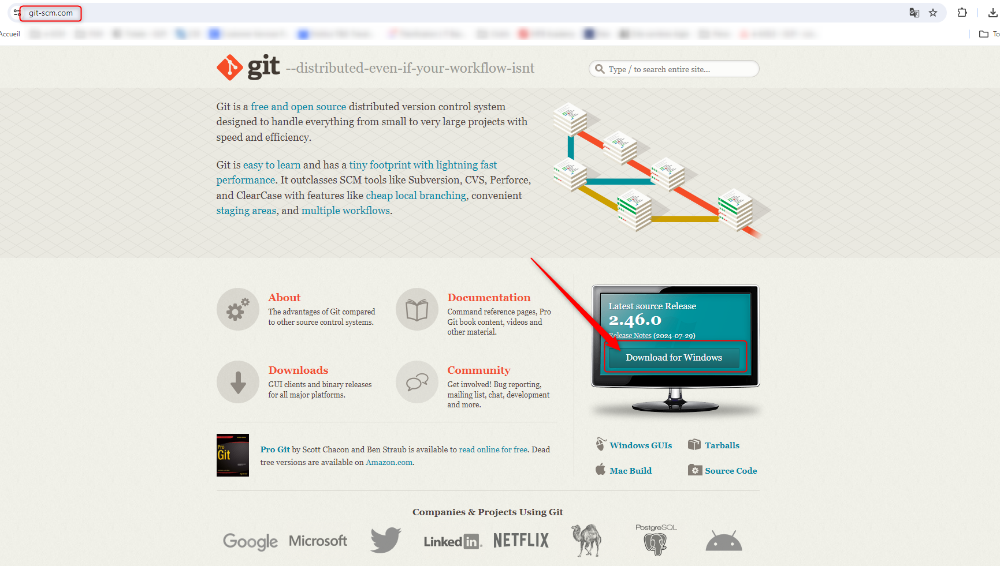
<br>

* Choisir la version <em>Standalone</em> 64-bit
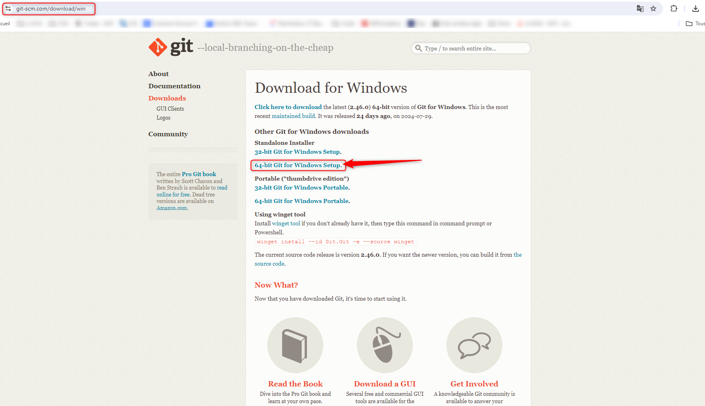
<br>

* Lancer l'exécutable
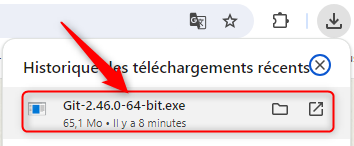
<br>

* Accepter les CGU
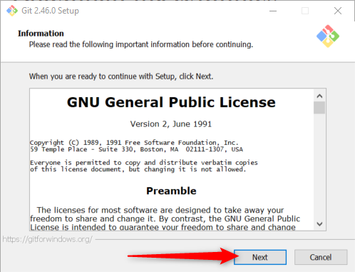
<br>

* Laisser l'emplacement de l'installation par défaut
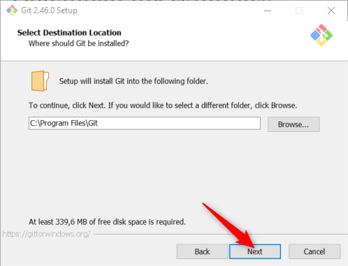
<br>

## Les composants à installer

* <em>Git Bash</em> est un émulateur de terminal pour Windows qui permet d'utiliser des commandes Git et des commandes Unix/Linux dans un environnement Windows. Il fournit une interface en ligne de commande pour interagir avec Git, facilitant la gestion des dépôts et des versions de code.
<br>
* <em>Git GUI</em> est une interface graphique pour Git, conçue pour simplifier l'utilisation des fonctionnalités de Git sans avoir à passer par la ligne de commande. Elle permet d'effectuer des opérations courantes comme le commit, le push, le pull ou la gestion des branches via des boutons et menus, offrant ainsi une approche visuelle pour gérer les dépôts Git.
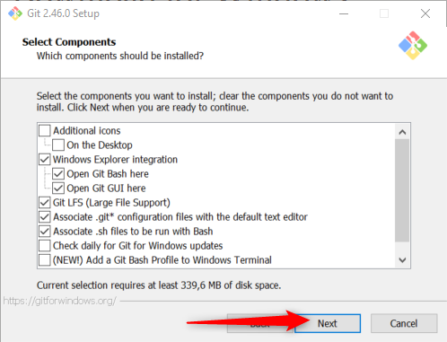
<br>

* Laisser le programme d'installation créer un raccourci
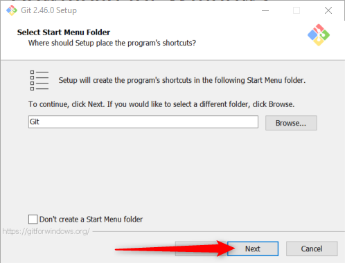
<br>

* Choisir Visual Studio Code comme éditeur par défaut
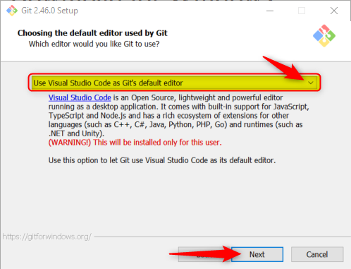
<br>

* Renommer la branche par défaut<em>main</em>
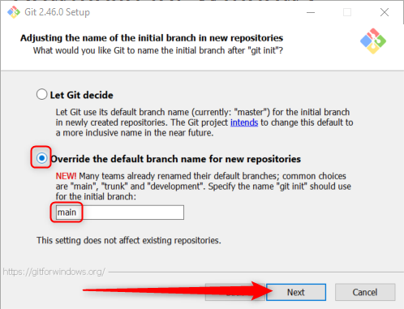
<br>

* Permettre Git d'être appelé depuis des programmes tiers
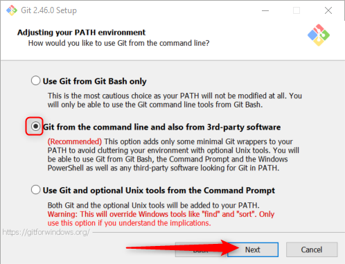
<br>

* Le protocole SSH sera utilisé pour communiquer avec les dépôts distants
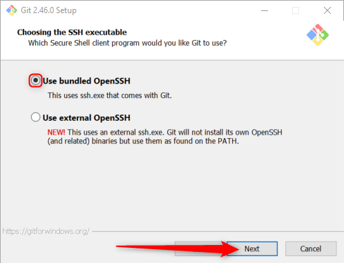
<br>

* Choisir les certificats par défaut
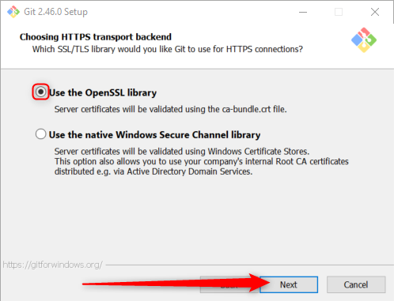
<br>

* Laisser Git gérer la différence de retours à la ligne entre Windows et Linux
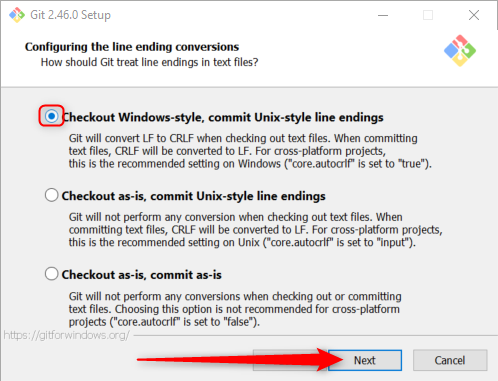
<br>

* Utiliser MinTTY comme emulateur de terminal
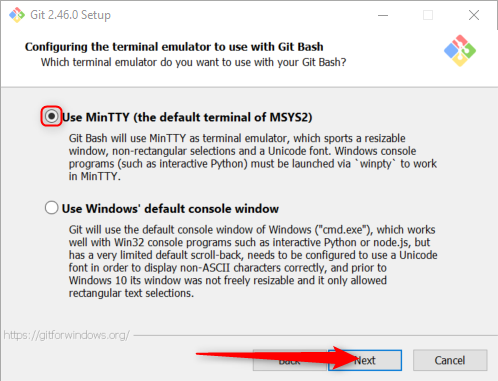
<br>

* Lorsque nous exécuterons la commande <code>git pull </code>, Git effectueras un <em>fast-forward</em> our un <em>merge commit</em> en fonction des différences entre les dépôts.
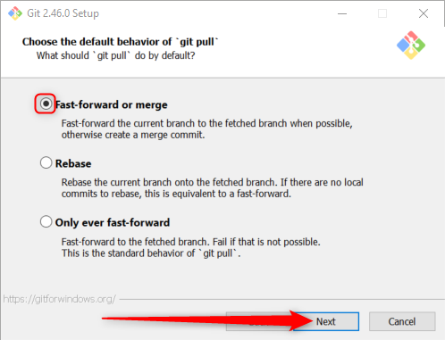
<br>

* * Pour s'authentifier et interragir avec des dépôts distants, nous avons besoin de <em>Git Credential Manger</em>
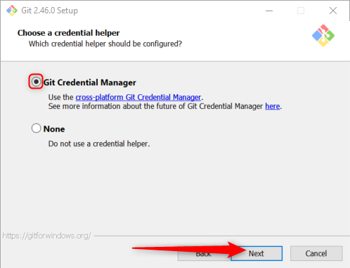
<br>

Le cache permet d'améliorer les performances du système.<br>
* Nous n'avons pas besoin de manipuler des liens symboliques dans les TP proposés<br>
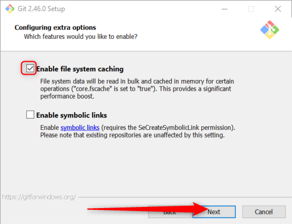
<br>

* Cette fonctionnalité n'est pas stable pour Git 2.46.0
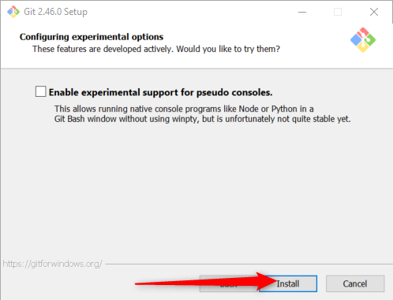
<br>

* L'installation se lance
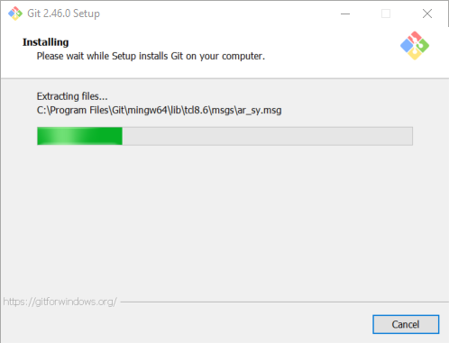
<br>

* Ouvrir Git Bash
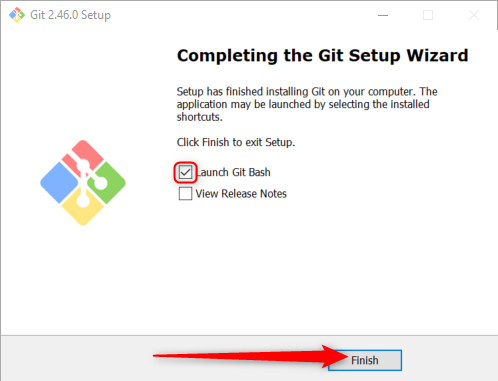
<br>

* Git Bash nous permet d'interragir avec notre système via des commandes Linux.<br>
<code>pwd</code> permet d'afficher le chemin d'accès vers le répertoire où se situe l'utilisateur qui a entré la commande
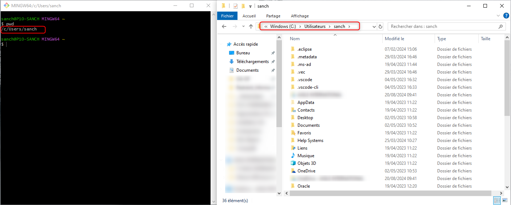
<br>