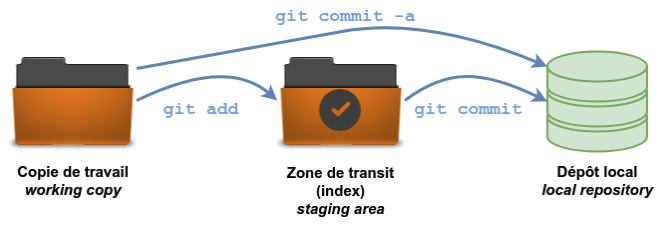

# Les trois zones du flux de travail

Dans Git, le flux de travail est structuré autour de trois zones principales : le répertoire de travail, l’index (ou *staging area*), et le dépôt (ou *repository*). Chacune de ces zones joue un rôle spécifique dans le suivi et la gestion des versions du projet.

### 1. **Le répertoire de travail (Working Directory)**

Le répertoire de travail correspond à l’espace où vous effectuez les modifications directement sur les fichiers de votre projet. Il s'agit de l'ensemble des fichiers et dossiers présents sur votre machine, où vous pouvez ajouter, modifier, ou supprimer des fichiers. Toute modification que vous effectuez dans ce répertoire est considérée comme "non suivie" par Git tant qu'elle n'est pas explicitement ajoutée à l’index.

- Exemple : Vous modifiez un fichier `main.py`. Tant que vous n'avez pas ajouté ces changements à l'index, Git sait que quelque chose a été changé dans le répertoire de travail, mais ne l'a pas encore enregistré pour la prochaine version.

### 2. **L’index (Staging Area)**

L'index, ou zone de transit, est une zone temporaire où vous préparez les modifications que vous souhaitez "commiter" (enregistrer dans le dépôt). C’est ici que vous "stocker" temporairement les fichiers modifiés ou ajoutés avant de les soumettre au dépôt. Cela vous permet de contrôler précisément quels changements seront inclus dans le prochain commit.

- Pour ajouter un fichier à l'index, vous utilisez la commande `git add`. Les fichiers présents dans l’index sont en attente d'être enregistrés dans le dépôt.
- Exemple : Si vous avez modifié trois fichiers, mais que vous ne voulez en enregistrer que deux dans votre prochaine version, vous pouvez les ajouter à l'index avec `git add`.

### 3. **Le dépôt (Repository)**

Le dépôt est l'endroit où les versions historiques de votre projet sont stockées. Il s'agit de la base de données Git qui contient l’historique de tous les commits effectués. Chaque fois que vous "committez" des changements depuis l'index vers le dépôt, Git prend un instantané de l'état actuel des fichiers dans l'index et l'ajoute à l’historique du projet.

- C’est ici que Git conserve toutes les versions de votre projet, permettant ainsi de revenir à des états précédents ou de consulter l’historique des modifications.
- Exemple : Après avoir ajouté vos fichiers à l’index, la commande `git commit` les enregistre dans le dépôt, créant ainsi un nouveau point dans l’historique des versions.

### Résumé du flux de travail :
1. **Répertoire de travail** : Vous travaillez sur vos fichiers.
2. **Index** : Vous sélectionnez les fichiers que vous souhaitez préparer pour un commit.
3. **Dépôt** : Vous enregistrez les fichiers dans l’historique en créant un commit.

Ce modèle permet une grande flexibilité et contrôle sur la manière dont les modifications sont gérées et enregistrées, assurant un développement structuré et collaboratif.  